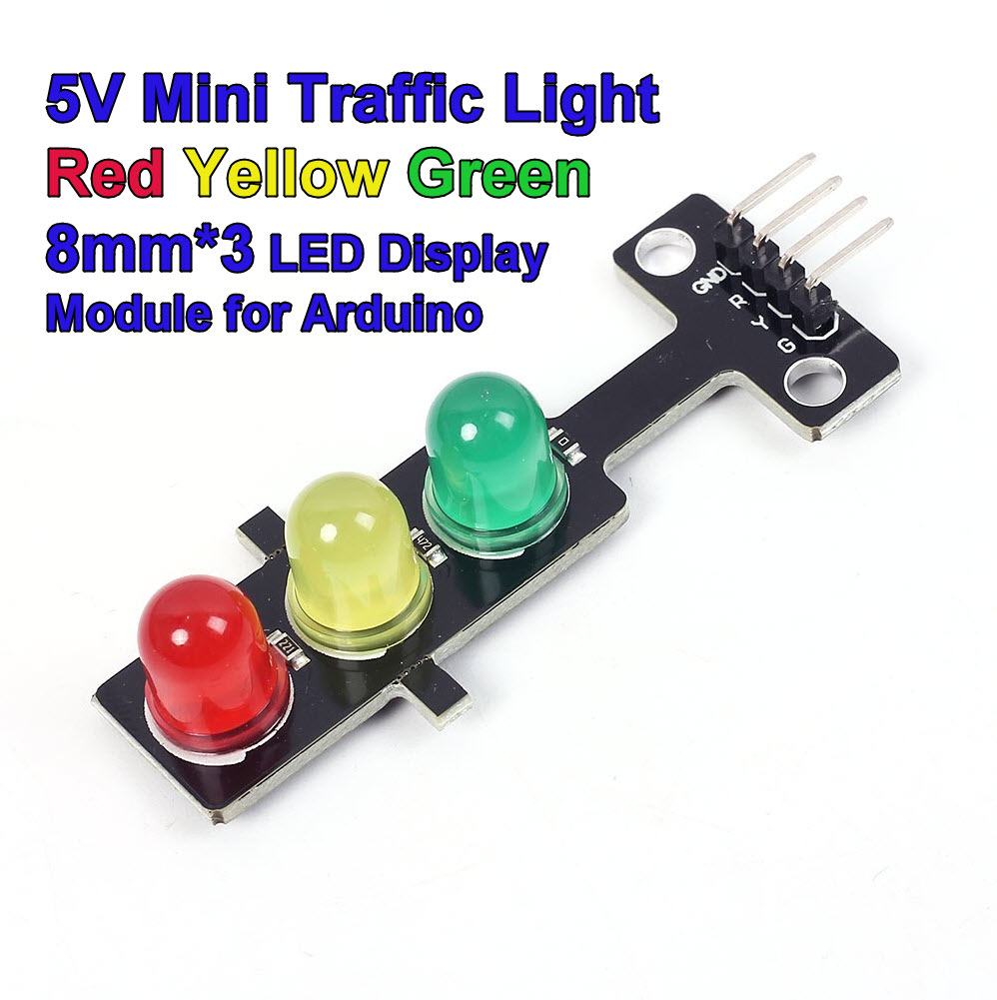

# ch32v003-traffic-light
Just for fun traffic light on ch32v003.

### Hardware
Wires:
* Red led connected to port c pin 5
* Yellow led connected to port c pin 6
* Green led connected to port c pin 7.

#### MCU
The board with MCU ch32v003 is V1772.

Here is example: https://aliexpress.ru/item/1005009059126505.html?gatewayAdapt=glo2rus&sku_id=12000052457686861

#### Led panel
I have used a led panel V1224.

Here is example: https://www.mcucity.com/product/2547/5v-mini-traffic-light-red-yellow-green-8mm-x-3-led-display-module-for-arduino-led-ryg

### Software
I have used a MounRiver IDE to compile and download binary to MCU.

To upload binary to MCU you need to use WCH LinkE module.
