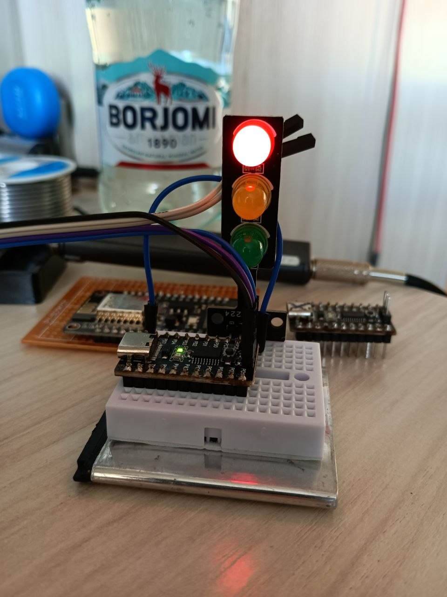

# ch32v003-traffic-light

Just for fun traffic light on ch32v003.

Red led connected to port c pin 5, Yellow led connected to port c pin 6 and Green connected to port c pin 7.
I have used a led panel V1224. The board with mcu is V1772.
